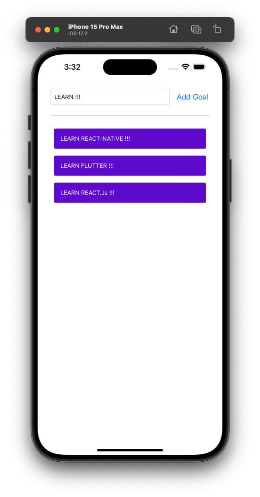

## To-Do App 📝
A simple and intuitive To-Do application built with React Native. This app helps you manage tasks efficiently, making it easier to stay organized and productive.

# Features ✨
Add, edit, and delete tasks.
Mark tasks as complete or incomplete.
Simple, clean, and user-friendly interface.
Persistent task storage using local storage or AsyncStorage.

## Screenshots

## 🔗 Links

